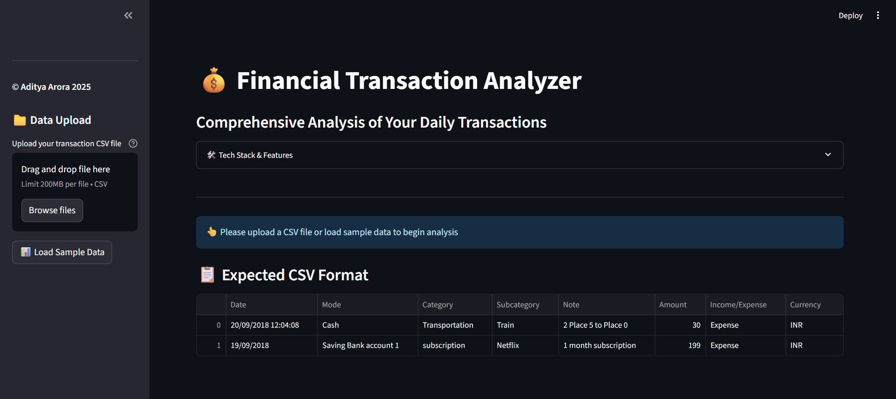
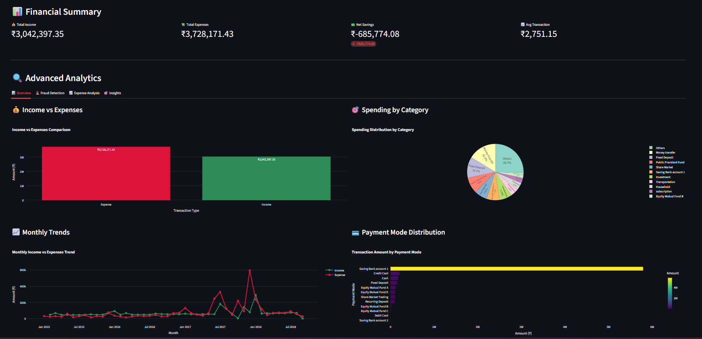

# 💸 MoneyMind — Your Smart Financial Assistant


---

## 🚀 Overview

MoneyMind is a powerful, AI-enhanced Streamlit web application that helps individuals take full control of their personal finances. With **personalized strategies**, **smart alerts**, and **intuitive visualizations**, you’ll gain clarity, control, and confidence over your financial journey.

## 🖼️ UI Preview



## 🎯 Analysis Output Screenshot



---

## 🧩 Features

### ✅ Personalized Financial Intelligence
- **Advanced Recommendations Engine**: Tailored advice based on your income, spending habits, and goals.
- **Category-Specific Advice**: Get insights for Food, Transportation, Entertainment, and more.

### 📉 Expense Reduction Strategies
- **Step-by-step Plans**: Learn exactly where and how to reduce expenses below your income level.
- **8 General + Personalized Tips**: From bulk buying to subscription cuts, tailored to your lifestyle.

### ⚡ Budget Control & Alerts
- **Weekly and Monthly Limits**: Set smart budget limits per category.
- **Emergency Overspending Alerts**: Be notified before your spending spirals.

### 📋 30-Day Action Plan
- A guided month-long plan to improve your financial situation, gradually and effectively.

### 🎯 Savings Target Visualization
- **Set & Track Your Savings Goal**: Visual progress bar toward a 20% savings target or custom goals.

### 💡 Payment Optimization
- Recommendations on the best payment methods and tools to track your expenses better.

---

## 📊 Technologies Used

Python

Streamlit

Pandas / NumPy

Matplotlib / Plotly

Custom rule-based recommendation engine

---

## 🗂️ Project Structure

```
MoneyMind/
│
├── app.py                   # Main Streamlit app
├── data_processor.py        # Handles all data loading, cleaning, and transformations
├── visualizations.py        # Contains chart and graph rendering logic
├── .streamlit/              # Streamlit config directory
├── attached_assets/         # Static assets like images or CSVs
├── pyproject.toml           # Python dependencies and build metadata
```

---

## 🛠️ How to Run

1. Clone the repository:
   ```bash
   git clone https://github.com/yourusername/MoneyMind.git
   cd MoneyMind
   ```

2. Create a virtual environment (optional but recommended):
   ```bash
   python -m venv venv
    .\venv\Scripts\activate
   ```

3. Install dependencies:
   ```bash
   pip install -r requirements.txt
   ```

4. Run the app:
   ```bash
   streamlit run app.py
   ```

5. If you face issues with 0.0.0.0, use:
   ```
   streamlit run app.py --server.address=localhost --server.port=8501
   ```
---
## 📌 Future Improvements

Login & user authentication

Cloud-based user data storage

Cross-platform budgeting sync (Google Sheets/Excel export)

Expense receipt scanner with OCR

---

## 📘 License

This project is licensed under the MIT License – see the [LICENSE](/license.txt) file for details.

---

## 🙌 Credits

Made with ❤️ by [Aditya Arora](https://www.linkedin.com/in/NeuralAditya)  
&copy; 2025 Aditya Arora. All rights reserved.

---
